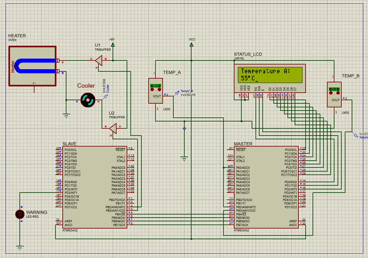
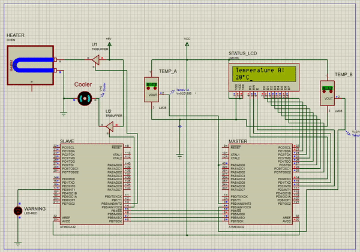
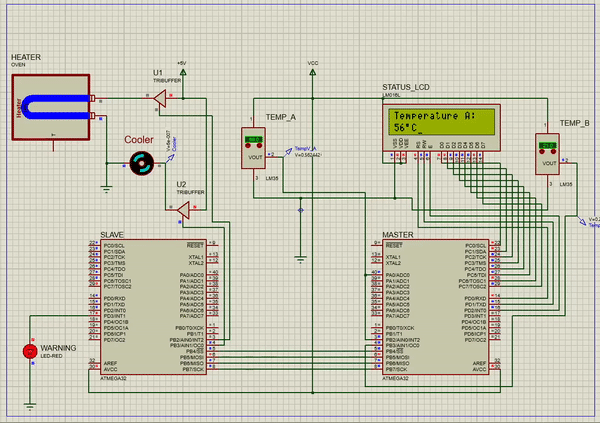

# Temperature Control System
The goal of this project was to design a temperature monitoring system that controls and regulates the temperature of a particular environment.

We need two ATMega32 microcontrollers, one to read the value of temperature and another to take action upon it. Therefore, the two chips is connected using a communication protocol (SPI is advised in this case). The tasks of each chip are mentioned below:

## The Master
  * Receives two temperature values `A` and `B` from `LM35 sensors`. (Temperatures range between `0 to 100` degrees.) 
  * Constantly compares the two values, and as long as `A` is ***higher*** than `B`, converts the analog value of A to digital. The conversion should happen in real-time and as fast as possible therefore, no use of comparator interrupts is recommended.
  * Sends the digital value of `A` to the slave.
  * Prints the digital value of `A` on a `16x2 alphanumeric LCD`.
  
## The Slave
  * Receives the temperature value from the master.
  * For temperatures between `25 and 55 degrees`, the cooler motor must be turned on, starting with a duty cycle of `50%` **plus** `10%` for every *additional 5 degrees*. (E.g., for a temperature of 37 degrees, the duty cycle is 70%)
  
  

  
  * Turns the heater on if the temperature is ***lower*** than `20 degrees`.
  
  

  
  * Makes a red warning LED blink if the temperature is ***higher*** than `55 degrees` (the cooler must stop working at this point).
  
  

